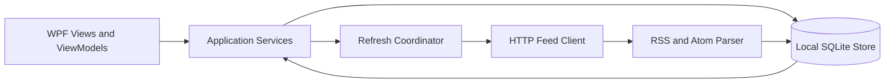

# RSS Reader Architecture

## Product Scope

Build a Windows desktop RSS/Atom reader where users can browse a feed catalog, subscribe to feeds, and read new items in a full-window interface. The app is an independent reader: it consumes feed URLs made available by publishers and does not depend on Feedly accounts, APIs, private endpoints, branding, or paid-service access controls. Feed content and availability remain subject to each publisher's terms and feed capabilities.

The first version is local-first and supports multiple local profiles. On startup, show the profile chooser; when no regular profiles exist, show the create-profile action as the primary option. Each regular profile owns its subscriptions, settings, folders, feed tags, reading state, and saved items. Cross-device sync and hosted services are out of scope until explicitly required.

Version 1 includes personal folders for organizing subscribed feeds, profile-owned public RSS/Atom feed URLs, OPML import/export for the active profile's subscriptions, tags assignable to feeds, article filters for read/unread and saved state (combinable with feed, folder, and tag selection), saved articles marked for reading later, and search across the active profile's locally stored articles. Search covers titles and feed-provided summary/content when available; it does not retrieve restricted article text. Saved-for-later state is independent of read/unread state.

Profiles have a user name and may have an optional password and recovery email address. Treat the password as an optional local profile-lock credential, not as a Feedly or publisher account. Never store a password in plaintext; store a salted, slow password hash and compare it using a maintained password-hashing API. A recovery email address is only stored as profile data until an actual recovery mechanism is designed. Email-based recovery requires a trusted delivery/verification service and must not be presented as functional in an offline-only build.

## Technology Baseline

- C# and .NET, targeting Windows.
- WPF for the desktop UI, using MVVM to separate view state and interaction from application logic.
- .NET Generic Host for dependency injection, configuration, and application lifetime.
- SQLite for local persistence.
- RSS and Atom parsing through a maintained .NET syndication/XML library; parser behavior will be covered by tests.
- Unit tests for application behavior and feed parsing, plus integration tests for persistence and refresh behavior where practical.

Confirm the installed .NET SDK and select supported package versions when the solution is scaffolded.

## Logical Components

- **Presentation:** WPF views, navigation, view models, and commands. The main window has a persistent navigation sidebar and one main workspace. The workspace shows either the article list or the selected article's reading view, not both side by side. Article list entries show the article title, source feed, and publication age/date.
- **Application:** Subscription management, catalog browsing, refresh coordination, article state, and search use cases.
- **Domain:** Feed, category, article, and user reading-state concepts, independent of WPF and persistence.
- **Infrastructure:** HTTP feed retrieval, RSS/Atom parsing, SQLite repositories, and catalog data.
- **Profiles:** Profile creation and selection, optional local unlock, and ownership boundaries for profile-specific data.
- **Catalog administration:** Catalog Master-only use cases for maintaining the shared feed catalog and its categories/collections.

Application logic depends on domain abstractions. WPF views do not perform network requests or access the database directly.

## Feed Refresh and Data Flow

RSS/Atom feeds are polled; they are not generally push streams. A background refresh service will fetch subscribed feeds on a configurable schedule, with bounded concurrency, cancellation, and per-feed error handling. Use HTTP conditional requests (`ETag` and `Last-Modified`) when supported, respect server responses and reasonable polling intervals, and avoid refreshing the same feed concurrently.

Store profile records plus profile-owned settings, feed subscriptions, folders, feed tags, reading state, and saved items. Store the shared catalog and its categories/collections separately from personal profile data. Enforce both profile ownership and catalog-management permissions in application services and repository operations so switching profiles cannot expose or mutate another profile's data and ordinary profiles cannot change the shared catalog. Store normalized feed and article metadata, subscription/category relationships, and per-profile read or saved state. Deduplicate items using stable feed identifiers where available, with a normalized link and publication data fallback. Keep feed failures isolated so one unavailable server does not stop other subscriptions from updating.

Deleting a catalog feed cascades across every profile: subscriptions, feed tags, refresh history, cached articles and their read/saved state, and collection memberships are removed. Deleting a category leaves its feeds in the catalog with no category; deleting a collection removes only its memberships and leaves its feeds untouched.

## Catalog and Feed Sources

The shared catalog supplies discoverable feed URLs, feed categories, and collections. A reserved local profile named **Catalog Master** is the sole profile allowed to add, edit, remove, or explicitly check shared catalog feeds, and to manage categories and collections. Regular profiles may subscribe to or unsubscribe from catalog feeds, and may separately add public RSS/Atom URLs to their own profile or import/export their subscriptions as OPML. Personal feeds are not published into the shared catalog or exposed to other profiles; feed metadata and downloaded articles for an identical URL are stored once locally, while subscriptions and read/saved state remain profile-scoped. Unfollowing a personal feed removes its ownership; if no other profile owns it, its cached feed and article data are deleted. Unfollowing a shared catalog feed leaves the shared feed and cached articles intact. OPML import accepts HTTP(S) feed URLs, skips invalid entries and duplicate subscriptions, and maps nested outlines to profile folders. Per-feed health checks on shared catalog feeds use the existing bounded downloader and persist only the result and check time; the result is historical, not a guarantee of continued availability. The catalog source, initial contents, and update mechanism remain open decisions. A catalog entry does not guarantee that a publisher provides full article text or frequent updates.

Catalog Master is created as a special local profile and has no password initially. It is hidden from the profile chooser unless the user holds Shift; while Shift is held, it appears as a selectable profile. Selecting it opens the catalog-management experience. Adding an optional password later requires the normal profile unlock flow. Shift-based visibility is discoverability only, not an access-control boundary: while Catalog Master has no password, anyone with access to the app can reveal and select it. Authorization must still be enforced in application logic, not only by hiding UI controls.

Only retrieve feeds and article content that the user is authorized to access. Do not automate access to paid accounts, circumvent publisher controls, or assume that an RSS subscription grants access to content beyond what the publisher exposes in the feed.

## Quality and Operational Requirements

- Keep network and database work off the UI thread; surface loading, empty, offline, and per-feed error states.
- Use cancellation when a refresh or navigation operation is no longer needed.
- Test parsing against representative RSS and Atom samples, including malformed and partial feeds.
- Test duplicate handling, conditional refresh behavior, and persistence of read/saved state.
- Keep local data usable offline; a failed refresh must not remove previously stored articles.
- Stored article text/HTML, summary, metadata, refresh state, and per-profile read/saved state remain local and available offline. Article and feed image URLs are stored, but image bytes load from publishers and are not cached, so images may be unavailable offline.
- Test Catalog Master catalog-management permissions independently of UI visibility, including attempts by regular profiles to add/remove catalog feeds, categories, and collections.
- Every feature is delivered with tests for its observable behavior; a feature is not complete until its tests pass.
- Unit-test domain rules, application services, and each view model's commands, state transitions, validation, and error handling. Exercise WPF control wiring and critical user workflows with UI-level or integration tests rather than treating visual controls as isolated unit-test targets.
- Integration-test SQLite persistence, profile-data isolation, and feed refresh boundaries. Include profile creation/selection, optional-password behavior, and switching profiles in the critical workflow coverage.
- Keep tests deterministic: use fake HTTP responses, temporary databases, and injected clocks or schedulers instead of live feeds, real email delivery, or timing-sensitive waits.

## Profile Security and Recovery

- Passwords are optional. A profile without a password can be opened directly; a password-protected profile must be unlocked before its data is shown.
- Regular profile names may contain letters, numbers, and spaces only; punctuation and other special characters are rejected. Names must contain at least one letter or number. Case sensitivity and uniqueness rules remain to be decided.
- Catalog Master is a reserved profile name and cannot be used for a regular profile.
- Password hashes protect profile unlock credentials; they do not encrypt the profile's database contents. Decide separately whether local data-at-rest encryption is required.
- A recovery email is not sufficient to recover a password by itself. Before implementing recovery, choose a secure verification and delivery mechanism, account for abuse and privacy, and define what works without network access. Until then, provide no email-based reset flow and clearly communicate the limitation.
- Profile name uniqueness, password-reset behavior, and whether deleting a profile permanently deletes its local data remain product decisions.

## Decisions to Resolve During Implementation

- Feed catalog initial contents and update mechanism.
- Refresh interval defaults and user controls.
- Profile name case sensitivity/uniqueness and profile deletion/backup behavior.
- Whether password recovery is supported, and the trusted service required to deliver and verify recovery challenges.
- Whether profile data must be encrypted at rest in addition to password-protecting profile access.
- Whether article reading uses feed-provided content, an in-app reader view, or the publisher's browser page.
- Import/export format and Windows installation/update approach.
